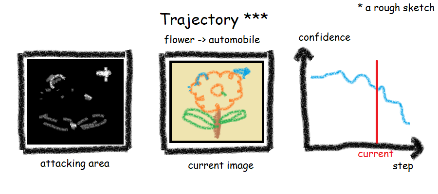

* content
{:toc}



# Python制作动态图-matplotlib.animation

## 目标

- 任务描述

  在进行图片[分类神经网络的欺骗](https://arxiv.org/abs/1412.1897)相关实验的时候，我们需要动态展示我们对图片的修改以及分类器confidence的变化，为此，我们需要制作动态图或视频的相关知识。

- 设计草图
  

## numpy数组 -> 图片

